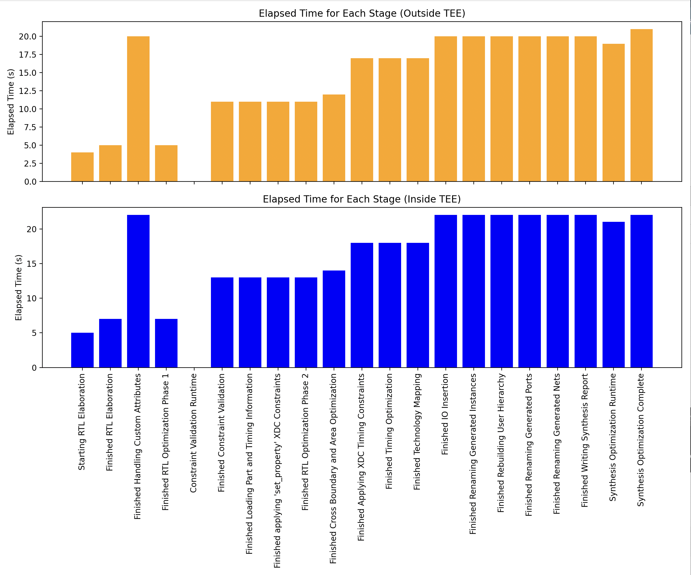

# Bitstream Generation Benchmark Comparison

This project compares the performance of bitstream generation inside and outside a Nitro Enclave Trusted Execution Environment (TEE).

## Requirements

- Python 3.6+
- Pandas
- Matplotlib

## Installation

1. Clone the repository or download the necessary files.
2. Create a `requirements.txt` file with the following content:

    ```plaintext
    pandas
    matplotlib
    ```

3. Install the required packages using pip:

    ```sh
    pip install -r requirements.txt
    ```

## Usage

Run the comparison script by providing the paths to the outside and inside log files as arguments:

```sh
python compare_bitstream_generation.py /path/to/log_outside /path/to/log_inside
```

Replace `/path/to/log_outside` and `/path/to/log_inside` with the actual paths to your log files.
A real example is two logs under design1, log.info and log_inside.info.

## Example

```sh
python compare_bitstream_generation.py logs/log_outside logs/log_inside
```

## Output

The script generates the following outputs:
1. `bitstream_generation_summary.csv`: A summary of the total elapsed time and peak memory usage for bitstream generation inside and outside the TEE.
2. `bitstream_generation_metrics_outside.csv`: Detailed metrics for each stage of bitstream generation outside the TEE.
3. `bitstream_generation_metrics_inside.csv`: Detailed metrics for each stage of bitstream generation inside the TEE.
4. Visual comparison plots displaying the elapsed time for each stage inside and outside the TEE.

## Visualizations

### Summary Metrics

The summary metrics provide a comparison of the total elapsed time and peak memory usage for bitstream generation inside and outside the TEE.

### Stage-by-Stage Comparison

The detailed stage-by-stage comparison helps identify specific stages where performance differences are more pronounced.

## Sample Output

### Summary Metrics

| Environment  | Total Elapsed Time | Peak Memory (MB) |
|--------------|---------------------|------------------|
| Outside TEE  | 0 days 00:05:06     | 2262.371         |
| Inside TEE   | 0 days 00:05:43     | 2195.375         |

### Detailed Metrics Comparison
#### Metrics Outside TEE

| Stage                                           | CPU Time | Elapsed Time | Peak Memory (MB) | Elapsed Time (s) |
|-------------------------------------------------|----------|--------------|------------------|------------------|
| Starting RTL Elaboration                        | 00:00:04 | 00:00:04     | 2047.805         | 4.0              |
| Finished RTL Elaboration                        | 00:00:05 | 00:00:05     | 2122.773         | 5.0              |
| Finished Handling Custom Attributes             | 00:00:05 | 00:00:05     | 2140.586         | 5.0              |
| Finished RTL Optimization Phase 1               | 00:00:05 | 00:00:05     | 2140.586         | 5.0              |
| Constraint Validation Runtime                   | 00:00:00 | 00:00:00     | 2262.371         | 0.0              |
| Finished Constraint Validation                  | 00:00:11 | 00:00:11     | 2262.371         | 11.0             |
| Finished Loading Part and Timing Information    | 00:00:11 | 00:00:11     | 2262.371         | 11.0             |
| Finished applying 'set_property' XDC Constraints| 00:00:11 | 00:00:11     | 2262.371         | 11.0             |
| Finished RTL Optimization Phase 2               | 00:00:11 | 00:00:11     | 2262.371         | 11.0             |
| Finished Cross Boundary and Area Optimization   | 00:00:12 | 00:00:12     | 2262.371         | 12.0             |
| Finished Applying XDC Timing Constraints        | 00:00:16 | 00:00:17     | 2262.371         | 17.0             |
| Finished Timing Optimization                    | 00:00:16 | 00:00:17     | 2262.371         | 17.0             |
| Finished Technology Mapping                     | 00:00:16 | 00:00:17     | 2262.371         | 17.0             |
| Finished IO Insertion                           | 00:00:20 | 00:00:20     | 2262.371         | 20.0             |
| Finished Renaming Generated Instances           | 00:00:20 | 00:00:20     | 2262.371         | 20.0             |
| Finished Rebuilding User Hierarchy              | 00:00:20 | 00:00:20     | 2262.371         | 20.0             |
| Finished Renaming Generated Ports               | 00:00:20 | 00:00:20     | 2262.371         | 20.0             |
| Finished Handling Custom Attributes             | 00:00:20 | 00:00:20     | 2262.371         | 20.0             |
| Finished Renaming Generated Nets                | 00:00:20 | 00:00:20     | 2262.371         | 20.0             |
| Finished Writing Synthesis Report               | 00:00:20 | 00:00:20     | 2262.371         | 20.0             |
| Synthesis Optimization Runtime                  | 00:00:19 | 00:00:19     | 2262.371         | 19.0             |
| Synthesis Optimization Complete                 | 00:00:20 | 00:00:21     | 2262.371         | 21.0             |

#### Metrics Inside TEE

| Stage                                           | CPU Time | Elapsed Time | Peak Memory (MB) | Elapsed Time (s) |
|-------------------------------------------------|----------|--------------|------------------|------------------|
| Starting RTL Elaboration                        | 00:00:05 | 00:00:05     | 2038.863         | 5.0              |
| Finished RTL Elaboration                        | 00:00:06 | 00:00:07     | 2113.801         | 7.0              |
| Finished Handling Custom Attributes             | 00:00:06 | 00:00:07     | 2131.613         | 7.0              |
| Finished RTL Optimization Phase 1               | 00:00:06 | 00:00:07     | 2131.613         | 7.0              |
| Constraint Validation Runtime                   | 00:00:00 | 00:00:00     | 2195.375         | 0.0              |
| Finished Constraint Validation                  | 00:00:12 | 00:00:13     | 2195.375         | 13.0             |
| Finished Loading Part and Timing Information    | 00:00:12 | 00:00:13     | 2195.375         | 13.0             |
| Finished applying 'set_property' XDC Constraints| 00:00:12 | 00:00:13     | 2195.375         | 13.0             |
| Finished RTL Optimization Phase 2               | 00:00:12 | 00:00:13     | 2195.375         | 13.0             |
| Finished Cross Boundary and Area Optimization   | 00:00:14 | 00:00:14     | 2195.375         | 14.0             |
| Finished Applying XDC Timing Constraints        | 00:00:18 | 00:00:18     | 2195.375         | 18.0             |
| Finished Timing Optimization                    | 00:00:18 | 00:00:18     | 2195.375         | 18.0             |
| Finished Technology Mapping                     | 00:00:18 | 00:00:18     | 2195.375         | 18.0             |
| Finished IO Insertion                           | 00:00:22 | 00:00:22     | 2195.375         | 22.0             |
| Finished Renaming Generated Instances           | 00:00:22 | 00:00:22     | 2195.375         | 22.0             |
| Finished Rebuilding User Hierarchy              | 00:00:22 | 00:00:22     | 2195.375         | 22.0             |
| Finished Renaming Generated Ports               | 00:00:22 | 00:00:22     | 2195.375         | 22.0             |
| Finished Handling Custom Attributes             | 00:00:22 | 00:00:22     | 2195.375         | 22.0             |
| Finished Renaming Generated Nets                | 00:00:22 | 00:00:22     | 2195.375         | 22.0             |
| Finished Writing Synthesis Report               | 00:00:22 | 00:00:22     | 2195.375         | 22.0             |
| Synthesis Optimization Runtime                  | 00:00:20 | 00:00:21     | 2195.375         | 21.0             |
| Synthesis Optimization Complete                 | 00:00:22 | 00:00:22     | 2195.375         | 22.0             |

### Visual Comparison

