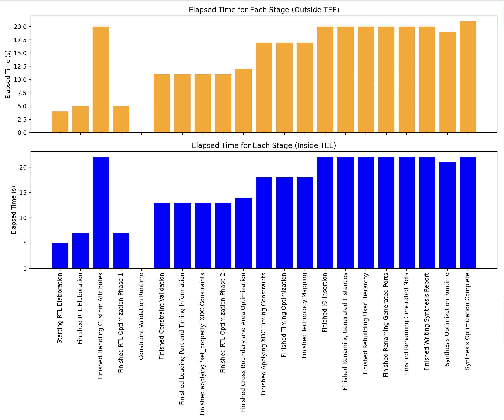

# Vivado Docker Images for Bitstream Generation and DRC

This repository provides Docker image setups to either generate a bitstream or run Design Rule Checks (DRC) using Vivado, with the ability to run these operations inside AWS Nitro Enclaves for enhanced security.

## Prerequisites

- Docker installed on your system.
- Access to the base image `072422391281.dkr.ecr.us-east-1.amazonaws.com/vivado:v2023.2`.
- For AWS Nitro Enclave usage: AWS CLI and appropriate AWS permissions.

## Files Overview

- `Dockerfile.generate-bitstream`: Defines the Docker image for bitstream generation.
- `Dockerfile.drc`: Defines the Docker image for running DRC.
- `generate_bitstream.sh`: Script to generate a bitstream.
- `run_drc.sh`: Script to run DRC.

## Building the Docker Images

To build the Docker images, navigate to the directory containing the Dockerfiles and run the following commands:

```sh
docker build -t vivado_bitstream:latest -f Dockerfile .
docker build -t vivado_drc:latest -f Dockerfile.drc .
```

## Running the Docker Containers

### Generating a Bitstream

To generate a bitstream, run the Docker container:

```sh
docker run --rm -v $(pwd):/home/ubuntu/designs/design1 vivado_bitstream:latest
```

### Running DRC

To run DRC, run the Docker container:

```sh
docker run --rm -v $(pwd):/home/ubuntu/designs/design1 vivado_drc:latest
```

## Running in AWS Nitro Enclave

To run these Docker images within an AWS Nitro Enclave, follow these steps:

1. Launch an EC2 instance with Nitro Enclaves enabled:

```sh
aws ec2 run-instances \
--image-id ami-0b5eea76982371e91 \
--count 1 \
--instance-type m5.16xlarge \
--key-name your-key-name \
--enclave-options 'Enabled=true' \
--block-device-mappings '[{"DeviceName":"/dev/xvda","Ebs":{"VolumeSize":200,"DeleteOnTermination":true}}]' \
--security-group-ids your-security-group-id \
--iam-instance-profile Name=your-instance-profile \
--tag-specifications 'ResourceType=instance,Tags=[{Key=Name,Value=nitro}]' \
--profile your-aws-profile
```

Note: The instance memory should be at least 8 times of the image size.

2. Connect to the instance and install necessary components:

```sh
sudo yum update -y
sudo amazon-linux-extras install docker
sudo amazon-linux-extras install aws-nitro-enclaves-cli -y
sudo yum install aws-nitro-enclaves-cli-devel -y
sudo usermod -aG ne $USER
sudo usermod -aG docker $USER
```

3. Configure the Nitro Enclave allocator:

Edit `/etc/nitro_enclaves/allocator.yaml` to set appropriate memory and CPU allocations:

```yaml
memory_mib: 16384  # Adjust as 4 times of image size
cpu_count: 4       # Adjust as needed
```

4. Enable and start necessary services:

```sh
sudo systemctl enable --now nitro-enclaves-allocator.service
sudo systemctl enable --now docker
```

5. Build the Enclave Image File (EIF):

```sh
nitro-cli build-enclave --docker-uri vivado_bitstream:latest --output-file vivado_bitstream.eif
```

6. Run the enclave:

```sh
nitro-cli run-enclave --eif-path vivado_bitstream.eif --memory 16384 --cpu-count 4 --attach-console --debug-mode
```

Replace `vivado_bitstream` with `vivado_drc` if you want to run DRC instead of bitstream generation.

## Notes

- Ensure that the necessary scripts and source files are copied correctly into the Docker images as specified in the Dockerfiles.
- The `generate_bitstream.sh` and `run_drc.sh` scripts are set as the entrypoints for their respective Docker images.
- The `LD_PRELOAD` environment variable is set to `/lib/x86_64-linux-gnu/libudev.so.1` to ensure proper functionality of Vivado within the containers.
- Both Docker images are based on the Vivado runtime image `072422391281.dkr.ecr.us-east-1.amazonaws.com/vivado:v2023.2`.
- When running in AWS Nitro Enclaves, be aware of the increased security measures and potential limitations on network access and file system persistence.

## Benchmark Result

| Environment  | Total Elapsed Time | Peak Memory (MB) |
|--------------|---------------------|------------------|
| Outside TEE  | 0 days 00:05:06     | 2262.371         |
| Inside TEE   | 0 days 00:05:43     | 2195.375         |

### Detailed Metrics Comparison
#### Metrics Outside TEE

| Stage                                           | CPU Time | Elapsed Time | Peak Memory (MB) | Elapsed Time (s) |
|-------------------------------------------------|----------|--------------|------------------|------------------|
| Starting RTL Elaboration                        | 00:00:04 | 00:00:04     | 2047.805         | 4.0              |
| Finished RTL Elaboration                        | 00:00:05 | 00:00:05     | 2122.773         | 5.0              |
| Finished Handling Custom Attributes             | 00:00:05 | 00:00:05     | 2140.586         | 5.0              |
| Finished RTL Optimization Phase 1               | 00:00:05 | 00:00:05     | 2140.586         | 5.0              |
| Constraint Validation Runtime                   | 00:00:00 | 00:00:00     | 2262.371         | 0.0              |
| Finished Constraint Validation                  | 00:00:11 | 00:00:11     | 2262.371         | 11.0             |
| Finished Loading Part and Timing Information    | 00:00:11 | 00:00:11     | 2262.371         | 11.0             |
| Finished applying 'set_property' XDC Constraints| 00:00:11 | 00:00:11     | 2262.371         | 11.0             |
| Finished RTL Optimization Phase 2               | 00:00:11 | 00:00:11     | 2262.371         | 11.0             |
| Finished Cross Boundary and Area Optimization   | 00:00:12 | 00:00:12     | 2262.371         | 12.0             |
| Finished Applying XDC Timing Constraints        | 00:00:16 | 00:00:17     | 2262.371         | 17.0             |
| Finished Timing Optimization                    | 00:00:16 | 00:00:17     | 2262.371         | 17.0             |
| Finished Technology Mapping                     | 00:00:16 | 00:00:17     | 2262.371         | 17.0             |
| Finished IO Insertion                           | 00:00:20 | 00:00:20     | 2262.371         | 20.0             |
| Finished Renaming Generated Instances           | 00:00:20 | 00:00:20     | 2262.371         | 20.0             |
| Finished Rebuilding User Hierarchy              | 00:00:20 | 00:00:20     | 2262.371         | 20.0             |
| Finished Renaming Generated Ports               | 00:00:20 | 00:00:20     | 2262.371         | 20.0             |
| Finished Handling Custom Attributes             | 00:00:20 | 00:00:20     | 2262.371         | 20.0             |
| Finished Renaming Generated Nets                | 00:00:20 | 00:00:20     | 2262.371         | 20.0             |
| Finished Writing Synthesis Report               | 00:00:20 | 00:00:20     | 2262.371         | 20.0             |
| Synthesis Optimization Runtime                  | 00:00:19 | 00:00:19     | 2262.371         | 19.0             |
| Synthesis Optimization Complete                 | 00:00:20 | 00:00:21     | 2262.371         | 21.0             |

#### Metrics Inside TEE

| Stage                                           | CPU Time | Elapsed Time | Peak Memory (MB) | Elapsed Time (s) |
|-------------------------------------------------|----------|--------------|------------------|------------------|
| Starting RTL Elaboration                        | 00:00:05 | 00:00:05     | 2038.863         | 5.0              |
| Finished RTL Elaboration                        | 00:00:06 | 00:00:07     | 2113.801         | 7.0              |
| Finished Handling Custom Attributes             | 00:00:06 | 00:00:07     | 2131.613         | 7.0              |
| Finished RTL Optimization Phase 1               | 00:00:06 | 00:00:07     | 2131.613         | 7.0              |
| Constraint Validation Runtime                   | 00:00:00 | 00:00:00     | 2195.375         | 0.0              |
| Finished Constraint Validation                  | 00:00:12 | 00:00:13     | 2195.375         | 13.0             |
| Finished Loading Part and Timing Information    | 00:00:12 | 00:00:13     | 2195.375         | 13.0             |
| Finished applying 'set_property' XDC Constraints| 00:00:12 | 00:00:13     | 2195.375         | 13.0             |
| Finished RTL Optimization Phase 2               | 00:00:12 | 00:00:13     | 2195.375         | 13.0             |
| Finished Cross Boundary and Area Optimization   | 00:00:14 | 00:00:14     | 2195.375         | 14.0             |
| Finished Applying XDC Timing Constraints        | 00:00:18 | 00:00:18     | 2195.375         | 18.0             |
| Finished Timing Optimization                    | 00:00:18 | 00:00:18     | 2195.375         | 18.0             |
| Finished Technology Mapping                     | 00:00:18 | 00:00:18     | 2195.375         | 18.0             |
| Finished IO Insertion                           | 00:00:22 | 00:00:22     | 2195.375         | 22.0             |
| Finished Renaming Generated Instances           | 00:00:22 | 00:00:22     | 2195.375         | 22.0             |
| Finished Rebuilding User Hierarchy              | 00:00:22 | 00:00:22     | 2195.375         | 22.0             |
| Finished Renaming Generated Ports               | 00:00:22 | 00:00:22     | 2195.375         | 22.0             |
| Finished Handling Custom Attributes             | 00:00:22 | 00:00:22     | 2195.375         | 22.0             |
| Finished Renaming Generated Nets                | 00:00:22 | 00:00:22     | 2195.375         | 22.0             |
| Finished Writing Synthesis Report               | 00:00:22 | 00:00:22     | 2195.375         | 22.0             |
| Synthesis Optimization Runtime                  | 00:00:20 | 00:00:21     | 2195.375         | 21.0             |
| Synthesis Optimization Complete                 | 00:00:22 | 00:00:22     | 2195.375         | 22.0             |

### Visual Comparison

