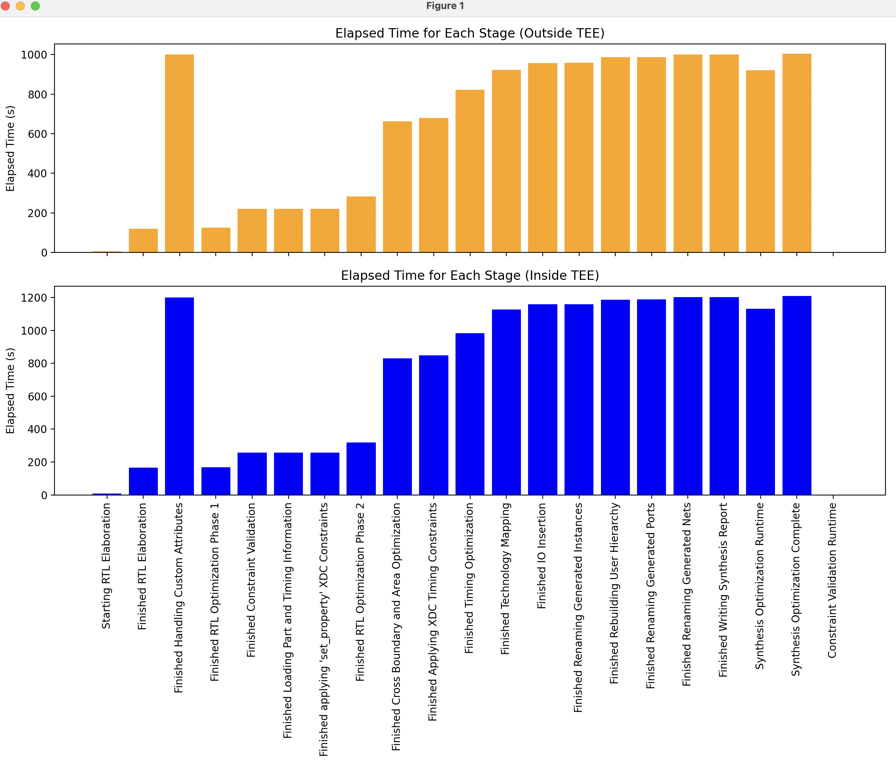

# FPGA Bitstream Generation Benchmark: AWS Nitro Enclave vs. Standard Environment for open-nic-shell

This project compares the performance of FPGA bitstream generation for the open-source project
open-nic-shell (https://github.com/Xilinx/open-nic-shell) using Vivado inside and outside of AWS Nitro
Enclave Trusted Execution Environment (software TEE).

## Table of Contents

- [Prerequisites](#prerequisites)
- [Setup](#setup)
- [Docker Image](#docker-image)
- [Running the Benchmark](#running-the-benchmark)
- [Benchmark Results](#benchmark-results)
- [Detailed Metrics Comparison](#detailed-metrics-comparison)
- [Visual Comparison](#visual-comparison)
- [Conclusion](#conclusion)

## Prerequisites

- AWS CLI
- Docker
- Access to AWS EC2 with Nitro Enclaves support
- Vivado installer: `FPGAs_AdaptiveSoCs_Unified_2023.2_1013_2256_Lin64.bin` (or latest version)

## Setup

1. Launch an EC2 instance with Nitro Enclaves enabled:

```bash
aws ec2 run-instances \
--image-id ami-0b5eea76982371e91 \
--count 1 \
--instance-type r5.16xlarge \
--key-name your-key-name \
--enclave-options 'Enabled=true' \
--block-device-mappings '[{"DeviceName":"/dev/xvda","Ebs":{"VolumeSize":200,"DeleteOnTermination":true}}]' \
--security-group-ids your-security-group-id \
--iam-instance-profile Name=your-instance-profile \
--tag-specifications 'ResourceType=instance,Tags=[{Key=Name,Value=open-nic-shell-benchmark}]' \
--profile your-aws-profile
```

2. Install dependencies:

```bash
sudo yum update -y
sudo amazon-linux-extras install docker
sudo amazon-linux-extras install aws-nitro-enclaves-cli -y
sudo yum install aws-nitro-enclaves-cli-devel -y
sudo usermod -aG ne $USER
sudo usermod -aG docker $USER
```

3. Configure the Nitro Enclave allocator:

Edit `/etc/nitro_enclaves/allocator.yaml`:

```yaml
memory_mib: 204800  # more than 4 times of the ELF image size (around 30GB) 
cpu_count: 2        # Adjust as needed
```

4. Enable and start necessary services:

```sh
sudo systemctl enable --now nitro-enclaves-allocator.service
sudo systemctl enable --now docker
```

## Docker Image

Create a Dockerfile for open-nic-shell:

```dockerfile
# Stage 1: Base setup and Vivado installation
FROM --platform=linux/amd64 ubuntu:20.04 AS base

# Preconfigure environment to avoid interactive prompts
ENV DEBIAN_FRONTEND=noninteractive
ENV TZ=Etc/UTC

# Install required packages
RUN apt-get update && apt-get install -y \
    build-essential \
    wget \
    curl \
    xz-utils \
    tar \
    libtinfo5 \
    libncurses5 \
    libx11-6 \
    libxrender1 \
    libxft2 \
    libxtst6 \
    locales \
    expect \
    git \
    && rm -rf /var/lib/apt/lists/*

# Set locale
RUN locale-gen en_US.UTF-8
ENV LANG=en_US.UTF-8
ENV LANGUAGE=en_US:en
ENV LC_ALL=en_US.UTF-8

# Create a directory for the installer
RUN mkdir -p /opt/Xilinx

# Copy the installer and expect script into the image
COPY ./FPGAs_AdaptiveSoCs_Unified_2023.2_1013_2256_Lin64.bin /opt/Xilinx/
COPY generate_token.expect /opt/Xilinx/

# Set working directory
WORKDIR /opt/Xilinx

# Make the installer and script executable
RUN chmod +x FPGAs_AdaptiveSoCs_Unified_2023.2_1013_2256_Lin64.bin
RUN chmod +x generate_token.expect

# Extract the installer
RUN ./FPGAs_AdaptiveSoCs_Unified_2023.2_1013_2256_Lin64.bin --noexec --target /opt/Xilinx/installer

# Copy secret password file
COPY password.txt /opt/Xilinx/password.txt

# Copy the install config file
COPY install_configs.txt /opt/Xilinx/install_configs.txt

# Generate the authentication token using expect script
RUN expect generate_token.expect /opt/Xilinx/password.txt

# Install Vivado
RUN /opt/Xilinx/installer/xsetup --agree XilinxEULA,3rdPartyEULA --location /opt/Xilinx --batch Install -c /opt/Xilinx/install_configs.txt

# Clone Xilinx Board Store repository
RUN git clone https://github.com/Xilinx/XilinxBoardStore.git /board_store

# Clone OpenNIC shell repository
RUN git clone https://github.com/Xilinx/open-nic-shell.git /open-nic-shell

# Stage 2: Final image setup
FROM ubuntu:20.04

# Set environment variables for Vivado
ENV PATH="/opt/Xilinx/Vivado/2023.2/bin:$PATH"
ENV LD_PRELOAD='/lib/x86_64-linux-gnu/libudev.so.1'

# Copy only the necessary files from the base stage
COPY --from=base /opt/Xilinx/Vivado /opt/Xilinx/Vivado
COPY --from=base /board_store /board_store
COPY --from=base /open-nic-shell /open-nic-shell

ENV DEBIAN_FRONTEND=noninteractive
ENV TZ=Etc/UTC

# Install necessary packages for building
RUN apt-get update && apt-get install -y \
    build-essential \
    wget \
    curl \
    xz-utils \
    tar \
    libtinfo5 \
    libncurses5 \
    libx11-6 \
    libxrender1 \
    libxft2 \
    libxtst6 \
    locales \
    expect \
    git \
    make \
    && rm -rf /var/lib/apt/lists/*

# Set locale
RUN locale-gen en_US.UTF-8
ENV LANG=en_US.UTF-8
ENV LANGUAGE=en_US:en
ENV LC_ALL=en_US.UTF-8

# Copy necessary scripts and source files into the Docker image
COPY generate_bitstream.sh /open-nic-shell/generate_bitstream.sh

# Set working directory
WORKDIR /open-nic-shell/script

# Set the default command to run the bitstream generation script
CMD ["/open-nic-shell/generate_bitstream.sh"]
```

Build the Docker image:

```bash
docker build -t open-nic-shell-bits:latest -f Dockerfile .
```

## Running the Benchmark

1. Outside TEE:

```bash
time docker run --rm open-nic-shell:latest
```

2. Inside TEE (AWS Nitro Enclave):

```bash
# Build the Enclave Image File (EIF)
nitro-cli build-enclave --docker-uri open-nic-shell:latest --output-file vivado_bitstream.eif &> >(tee build.log)

# Run the enclave
time nitro-cli run-enclave --eif-path vivado_bitstream.eif --memory 204800 --cpu-count 2 --attach-console --debug-mode &> >(tee log.inside-tee)
```

## Benchmark Results

| Environment | Total Elapsed Time | User Time | System Time |
|-------------|--------------------|-----------| ------------|
| Outside TEE | 141m 10.620s       | 194m 51.533s | 5m 38.535s |
| Inside TEE  | 165m 48.894s       | 73m 6.774s | 3m 15.383s |

## Detailed Metrics Comparison

## Visual Comparison



## Conclusion

This benchmark compares the performance of generating a bitstream for the open-source open-nic-shell project using
Vivado inside and outside of an AWS Nitro Enclave. The results show:

1. An increase in total elapsed time inside the TEE (165m 48.894s) compared to outside (141m 10.620s), representing about a 17.5% overhead.
2. Significantly lower user time inside the TEE (73m 6.774s) compared to outside (194m 51.533s), which could indicate differences in how CPU time is measured or allocated in the enclave environment.
3. Lower system time inside the TEE (3m 15.383s) compared to outside (5m 38.535s).

These findings suggest that running bitstream generation for the open-nic-shell project inside an AWS Nitro Enclave
provides enhanced security with a moderate performance overhead. The significant difference in user time warrants further investigation to understand the cause and potential implications for resource utilization and billing.

The trade-off between security and performance should be evaluated based on specific project requirements, especially in scenarios involving sensitive IP cores or multi-tenant environments.