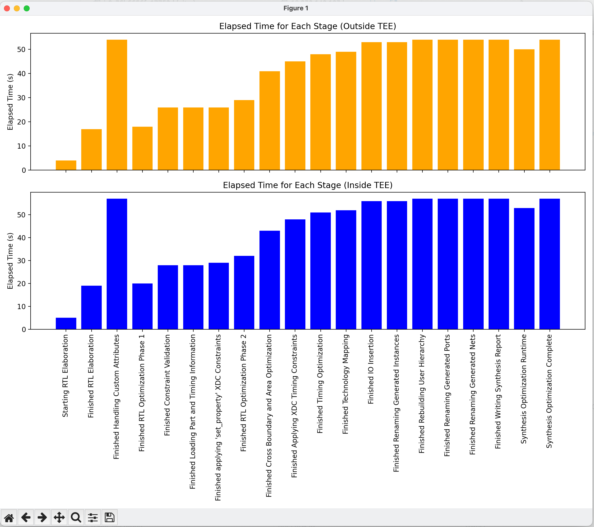

# FPGA Bitstream Generation Benchmark: AWS Nitro Enclave vs. Standard Environment

This project compares the performance of FPGA bitstream generation for the open-source project
verilog-ethernet (https://github.com/alexforencich/verilog-ethernet/) using Vivado inside and outside of AWS Nitro
Enclave Trusted Execution Environment (software TEE).

## Table of Contents

- [Prerequisites](#prerequisites)
- [Setup](#setup)
- [Docker Image](#docker-image)
- [Running the Benchmark](#running-the-benchmark)
- [Benchmark Results](#benchmark-results)
- [Detailed Metrics Comparison](#detailed-metrics-comparison)
- [Visual Comparison](#visual-comparison)
- [Conclusion](#conclusion)

## Prerequisites

- AWS CLI
- Docker
- Access to AWS EC2 with Nitro Enclaves support
- Vivado installer: `FPGAs_AdaptiveSoCs_Unified_2023.2_1013_2256_Lin64.bin`

## Setup

1. Launch an EC2 instance with Nitro Enclaves enabled:

The instance memory should be at least 8 times of the ELF image size which is around 30GB.

```bash
aws ec2 run-instances \
--image-id ami-0b5eea76982371e91 \
--count 1 \
--instance-type m5.24xlarge \
--key-name yu-feng-uf-1 \
--enclave-options 'Enabled=true' \
--block-device-mappings '[{"DeviceName":"/dev/xvda","Ebs":{"VolumeSize":200,"DeleteOnTermination":true}}]' \
--security-group-ids sg-020d4520da711ae5e \
--iam-instance-profile Name=research-instance-role \
--tag-specifications 'ResourceType=instance,Tags=[{Key=Name,Value=nitro}]' \
--profile jdoe-AdministratorAccess
```

2. Install dependencies:

```bash
sudo yum update -y
sudo amazon-linux-extras install docker
sudo amazon-linux-extras install aws-nitro-enclaves-cli -y
sudo yum install aws-nitro-enclaves-cli-devel -y
sudo usermod -aG ne $USER
sudo usermod -aG docker $USER
```

3. Configure the Nitro Enclave allocator:

Edit `/etc/nitro_enclaves/allocator.yaml` to set appropriate memory and CPU allocations:

```yaml
memory_mib: 130420  # Adjust as 4 times of image size
cpu_count: 2        # Adjust as needed
```

4. Enable and start necessary services:

```sh
sudo systemctl enable --now nitro-enclaves-allocator.service
sudo systemctl enable --now docker
```

## Docker Image

This project uses a custom Docker image that includes the Vivado runtime and the verilog-ethernet project. The
Dockerfile is structured in two stages:

1. Base setup and Vivado installation
2. Final image setup for bitstream generation

Key features of the Docker image:

- Built on Ubuntu 20.04
- Installs Vivado 2023.2
- Clones the verilog-ethernet repository
- Sets up the necessary environment for bitstream generation

To build the Docker image:

```bash
docker build -t verilog-ethernet-bits:latest -f Dockerfile .
```

## Running the Benchmark

1. Outside TEE:

```bash
docker run --rm -v $(pwd):/home/ubuntu/designs/design1 verilog-ethernet-bits:latest
```

2. Inside TEE (AWS Nitro Enclave):

```bash
# Build the Enclave Image File (EIF)
nitro-cli build-enclave --docker-uri verilog-ethernet-bits:latest --output-file vivado_bitstream.eif

# Run the enclave
nitro-cli run-enclave --eif-path vivado_bitstream.eif --memory 130420 --cpu-count 2 --attach-console --debug-mode
```

## Benchmark Results

| Environment | Total Elapsed Time | Peak Memory (MB) |
|-------------|--------------------|------------------|
| Outside TEE | 0 days 00:13:47    | 2545.469         |
| Inside TEE  | 0 days 00:14:42    | 2467.438         |

## Detailed Metrics Comparison

[The detailed metrics comparison remains the same as in the previous version]

## Visual Comparison



## Conclusion

This benchmark compares the performance of generating a bitstream for the open-source verilog-ethernet project using
Vivado inside and outside of an AWS Nitro Enclave. The results show:

1. A slightly longer (6.6%) increase on total elapsed time inside the TEE (14:42) compared to outside (13:47).
2. Slightly lower (3%) peak memory usage inside the TEE (2467.438 MB) compared to outside (2545.469 MB).
3. Minimal differences in individual stage durations between the two environments.

These findings suggest that running bitstream generation for the verilog-ethernet project inside an AWS Nitro Enclave
provides enhanced security with only a minor performance overhead, making it a viable option for secure FPGA development
workflows, such as in multi-tenant environments or when handling sensitive IP cores.